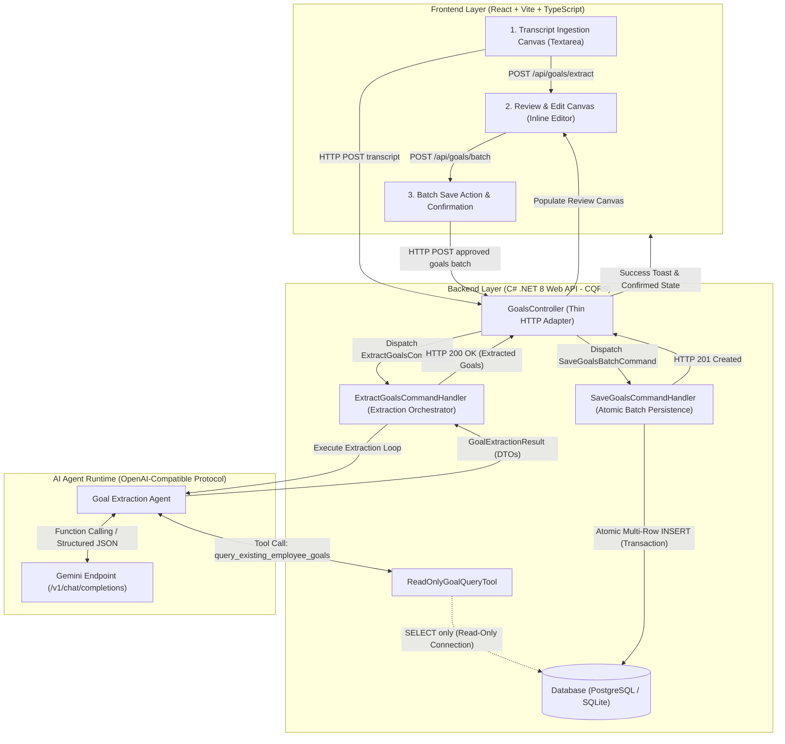
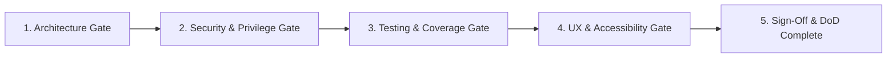

# Product Backlog Item (PBI): Agentic Goal Extraction & Persistence Canvas

| Metadata Field | Value |
| :--- | :--- |
| **PBI ID** | `PBI-AI-GOAL-001` |
| **Title** | Agentic Goal Extraction & Persistence Canvas with CQRS & Zero-Write AI Isolation |
| **Target Milestone** | Sprint 1 — Foundation & Human-in-the-Loop (HITL) Workflow |
| **Epic / Theme** | Agentic Performance Management & Operational Automation |
| **Priority** | Critical / P0 |
| **Status** | Approved / Ready for Architecture & Task Planning |
| **Tech Stack** | Backend: C# .NET 8 Web API (CQRS) · Frontend: React + Vite + TypeScript · AI: Gemini OpenAI-Compatible Endpoint |
| **Reference Documents** | [`Description.md`](file:///home/vlads4r4/dev/side-projects/Agentic__Transcribe_Goal_Todolist/Description.md) · [`AcceptanceCriteria.md`](file:///home/vlads4r4/dev/side-projects/Agentic__Transcribe_Goal_Todolist/AcceptanceCriteria.md) |

---

## 1. User Persona & Value Statement

### 1.1 Target Personas
* **Primary Persona: Engineering / People Manager ("Marcus")**
  * *Context*: Conducts weekly 1:1 meetings, quarterly reviews, and performance calibration sessions with software engineers and cross-functional team members.
  * *Pain Point*: Spends 30–45 minutes per employee manually condensing messy meeting notes into structured SMART goals, frequently losing nuance or missing overlap with existing organizational objectives.
* **Secondary Persona: Individual Contributor / Employee ("Elena")**
  * *Context*: Reviews proposed goals agreed upon during alignment syncs before they become formal commitments in the corporate goal tracking system.
  * *Pain Point*: Frustrated when performance goals are misattributed, duplicative of completed initiatives, or entered without transparent personal review.

### 1.2 Agile Value Statement
> **As an** Engineering Manager or People Lead conducting performance reviews and 1:1 alignment meetings,  
> **I want** an intelligent AI agent to analyze discussion transcripts, automatically query existing employee goals for context, and present candidate SMART goals within an interactive review canvas,  
> **So that** I can rapidly refine, validate, and atomically persist agreed-upon goals while ensuring that AI operates under strict read-only isolation and never mutates company data without explicit human approval.

---

## 2. Problem Statement & Strategic Objective

### 2.1 Problem Statement
In modern engineering and enterprise organizations, 1:1 syncs and performance reviews generate critical alignment data trapped in unstructured notes and meeting transcripts. Translating these dialogues into actionable, measurable goals in database systems suffers from three major flaws:
1. **Administrative Drag**: Manual translation is tedious, resulting in delayed goal entry or abandoned tracking.
2. **Context Blindness & Duplication**: Standard AI prompt tools lack real-time access to the employee's existing active or historical goals, frequently generating redundant or contradictory targets.
3. **Autonomous Risk & Lack of Governance**: Naive agentic implementations grant LLMs direct write permissions to databases, exposing enterprise systems to hallucinations, prompt injections, and accidental data corruption.

### 2.2 Strategic Objective
Deliver an enterprise-grade, human-in-the-loop (HITL) goal extraction and persistence system that guarantees:
* **Zero Autonomous Writes**: The AI Agent is isolated to read-only tool invocation.
* **CQRS Decoupling**: Backend operations strictly separate goal extraction orchestration (`ExtractGoalsCommandHandler`) from atomic batch persistence (`SaveGoalsCommandHandler`).
* **Human Oversight**: Extracted goals are purely advisory proposals rendered on a responsive React review canvas for inline editing, manual additions, and explicit user commitment.
* **Robust Integration**: Backed by C# .NET 8 Web API, React + Vite + TypeScript, and a Gemini OpenAI-compatible endpoint using structured schema validation.

---

## 3. System Architecture & Technical Constraints

### 3.1 Architectural Flow Diagram



### 3.2 Technical Constraints & Specifications

| Component | Technology / Standard | Strict Architectural Constraints |
| :--- | :--- | :--- |
| **Backend Framework** | C# .NET 8 Web API | • Strict CQRS pattern via MediatR / Command Handlers.<br>• Thin API Controller: zero database queries and zero LLM calls in controllers.<br>• Explicit DTO validation using FluentValidation.<br>• OpenTelemetry correlation tracking with `X-Correlation-ID`. |
| **Frontend Framework** | React 18+ / Vite / TypeScript | • Responsive, accessible Single Page Interface.<br>• Client-side input sanitization, min (20 chars) and max (32,000 chars) boundary checks.<br>• Interactive review canvas with inline field edits, card deletion, and manual card addition.<br>• UI-level provenance tracking (`AI_ORIGINAL`, `AI_MODIFIED`, `MANUAL`). |
| **AI Integration** | Gemini OpenAI-Compatible Endpoint | • Target: Gemini API via OpenAI-compatible endpoint (`/v1/chat/completions`) using provided API key (`GEMINI_API_KEY`).<br>• Fully configurable base URL and model name (with fallback compatibility for Titan URL / Qwen models).<br>• JSON Schema enforcement for structured output extraction.<br>• Function/tool calling support for querying existing employee goals. |
| **Database Tooling** | `ReadOnlyGoalQueryTool` | • Agent tool restricted to querying active and historical goals by `employeeId`.<br>• Dependent on code-level `IReadOnlyGoalQueryRepository` containing **only query methods**.<br>• Bound to dedicated read-only database user/connection (`SELECT` permissions only). |
| **AI Isolation Guarantee** | Strict Read-Only Boundary | • **Zero Write Privileges**: AI agent and tools cannot issue `INSERT`, `UPDATE`, `DELETE`, or DDL commands.<br>• Physical DB credential isolation + `SET TRANSACTION READ ONLY` where applicable.<br>• Code isolation: AI extraction handler has no reference or dependency on write repositories or save handlers. |
| **Persistence Engine** | `SaveGoalsCommandHandler` | • Completely decoupled from AI agent dependencies.<br>• Executes atomic multi-goal batch persistence inside an explicit database transaction (`IDbTransaction` / EF Core execution strategy).<br>• All-or-nothing rollback on failure; audit logging (`createdAt`, `createdBy`, `sourceTranscriptHash`).<br>• Idempotency enforcement to prevent duplicate submissions. |

---

## 4. User Stories & Scope Boundaries

### 4.1 User Stories

* **US-01: Transcript Ingestion & Pre-Validation**  
  *As an Engineering Manager, I want to paste raw discussion notes or meeting transcripts into a responsive input area with instant character validation, so that I can submit clean content to the extraction engine.*
* **US-02: CQRS Decoupled Command Dispatch**  
  *As a Backend Architect, I want the API controller to dispatch an immutable `ExtractGoalsCommand` to a dedicated handler without executing business logic directly, so that the HTTP layer remains decoupled and maintainable.*
* **US-03: Retrieval-Augmented Goal Extraction**  
  *As an AI Extraction Engine, I want to query existing employee goals through a read-only database tool before prompting the LLM, so that I can contextualize new goals, prevent duplicates, and output structured SMART objectives.*
* **US-04: Strict AI Read-Only Boundary & Security Sandboxing**  
  *As a Security Officer, I want physical and architectural constraints guaranteeing zero write privileges for the AI agent, so that prompt injections or autonomous agents cannot corrupt production databases.*
* **US-05: Human-in-the-Loop Review Canvas**  
  *As an Engineering Manager, I want to inspect, edit, delete, or manually augment AI-proposed goals on an interactive canvas, so that every goal committed to the system is human-verified and accurate.*
* **US-06: Atomic Multi-Goal Persistence**  
  *As a System Administrator, I want approved goal batches persisted through an isolated `SaveGoalsCommandHandler` within an atomic transaction, so that data writes succeed completely or roll back cleanly without partial corruption.*

### 4.2 Scope Boundaries

#### In-Scope
* Single-page responsive web client built with React, Vite, and TypeScript.
* Textarea input supporting 20 to 32,000 characters with live counter and sanitization.
* C# .NET 8 Web API backend implementing CQRS commands and handlers (`ExtractGoalsCommand`, `SaveGoalsBatchCommand`).
* Integration with Gemini OpenAI-compatible endpoint using API key authentication.
* Read-only database query tool (`query_existing_employee_goals`) supporting employee goal lookups.
* Structured JSON schema enforcement for LLM responses (`title`, `description`, `category`, `metric`, `timeframe`, `priority`).
* Interactive review canvas: inline editing, deletion with confirmation/undo, manual goal creation, and provenance badges.
* Atomic multi-record batch persistence into relational database (PostgreSQL / SQLite via EF Core or Dapper).
* Full automated testing suite: Unit tests (>= 85% coverage), integration tests, schema validation, and read-only security permission tests.

#### Out-of-Scope (Future Iterations)
* Real-time audio streaming speech-to-text (STT) transcription (users paste existing text transcripts).
* Multi-tenant Enterprise SSO / SAML 2.0 (standard API authentication headers used for MVP).
* Direct bidirectional sync with Jira, Asana, or Workday HRIS (planned for Phase 2).
* Autonomous auto-save or scheduled background extraction without human review (strictly prohibited by architectural invariants).

---

## 5. Detailed Acceptance Criteria Mapping (AC 1 through AC 6)

The following criteria map directly to the formal specification defined in [`AcceptanceCriteria.md`](file:///home/vlads4r4/dev/side-projects/Agentic__Transcribe_Goal_Todolist/AcceptanceCriteria.md).

### AC 1: Transcript Ingestion (Frontend Textarea & Validation)
* **AC 1.1 — UI Input Element**: Dedicated `<textarea>` with `aria-label="Discussion Transcript"`, placeholder guide, and real-time character counter.
* **AC 1.2 — Character Constraints**: Minimum **20 characters**; maximum **32,000 characters** (approx. 8,000 tokens) to guard context windows.
* **AC 1.3 — Sanitization**: Strips non-printable control characters while preserving standard newlines (`\n`, `\r\n`) and bullet lists.
* **AC 1.4 — Action States**: "Extract Goals" button is disabled below 20 characters or above 32,000 characters. Submitting triggers an animated loading indicator (*"Analyzing transcript with AI Agent..."*) and locks the textarea.
* **AC 1.5 — Network Contract**: `POST /api/goals/extract` with body:
  ```json
  {
    "transcript": "string (20-32000 chars)",
    "context": {
      "employeeId": "string (UUID)",
      "department": "string (optional)"
    }
  }
  ```

### AC 2: Controller & CQRS CommandHandler Decoupling
* **AC 2.1 — Thin Controller**: `GoalsController` acts exclusively as an HTTP gateway: deserializes input, executes FluentValidation, dispatches `ExtractGoalsCommand`, and maps results to HTTP status codes (`200 OK`, `400 Bad Request`, `504 Gateway Timeout`).
* **AC 2.2 — Command/Handler Separation**: `ExtractGoalsCommand` is an immutable record; `ExtractGoalsCommandHandler` implements `IRequestHandler<ExtractGoalsCommand, GoalExtractionResultDto>`.
* **AC 2.3 — Orchestration Isolation**: Handler coordinates agent execution, cancellation tokens, and timeouts (30s threshold). Zero direct SQL or inline LLM SDK code in the Controller.
* **AC 2.4 — Distributed Tracing**: Generates and propagates `X-Correlation-ID` across HTTP headers, logs, and agent metadata.

### AC 3: AI Agent Extraction Loop & Read-Only Database Tool
* **AC 3.1 — LLM Endpoint Config**:
  * Protocol: OpenAI Chat Completions compatible (`/v1/chat/completions`).
  * Base URL: Configurable via `AI_LLM_BASE_URL` (default: Gemini OpenAI-compatible endpoint; fallback: Titan URL).
  * API Key: Configured via `AI_LLM_API_KEY` (Gemini API Key).
  * Model Name: Configurable via `AI_LLM_MODEL`.
* **AC 3.2 — Read-Only DB Tool (`query_existing_employee_goals`)**:
  * Parameters: `employeeId` (string/UUID, required), `status` (enum: `ACTIVE`, `COMPLETED`, `ALL`), `limit` (int, default 10).
  * Invoked by agent to inspect existing goals and eliminate duplicate proposals.
* **AC 3.3 — Agent Loop Execution**: Evaluates transcript -> executes DB tool query if employee context exists -> prompts LLM with combined context -> parses structured output.
* **AC 3.4 — Strict JSON Schema Enforcement**:
  ```json
  {
    "type": "object",
    "properties": {
      "summary": { "type": "string" },
      "goals": {
        "type": "array",
        "items": {
          "type": "object",
          "properties": {
            "title": { "type": "string", "minLength": 5, "maxLength": 120 },
            "description": { "type": "string", "minLength": 10, "maxLength": 1000 },
            "category": { "type": "string", "enum": ["PERFORMANCE", "DEVELOPMENT", "PROJECT", "TECHNICAL"] },
            "metric": { "type": "string" },
            "timeframe": { "type": "string" },
            "priority": { "type": "string", "enum": ["HIGH", "MEDIUM", "LOW"] }
          },
          "required": ["title", "description", "category", "metric", "priority"]
        }
      }
    },
    "required": ["goals"]
  }
  ```

### AC 4: AI Read-Only Boundary & Zero-Write Guarantee
* **AC 4.1 — Credential Isolation**: The agent's database connection pool uses a dedicated read-only role (`app_agent_readonly`) granted **only** `SELECT` privileges. All `INSERT`, `UPDATE`, `DELETE`, `DROP`, and `ALTER` grants are withheld.
* **AC 4.2 — Interface Segregation**: The tool depends exclusively on `IReadOnlyGoalQueryRepository`. No mutating methods exist on this interface.
* **AC 4.3 — Read-Only Connection Flags**: Connection initializes with `SET TRANSACTION READ ONLY` where supported.
* **AC 4.4 — Prompt Injection Resilience**: Hostile instructions in transcripts attempting database mutation are neutralized by system prompt boundaries and physically blocked by database-level privilege denial.

### AC 5: Frontend Review & Inline Editing Canvas
* **AC 5.1 — Goal Card Presentation**: Renders each extracted goal as an interactive card displaying editable inputs for `Title`, `Description`, `Category` (dropdown), `Metric`, `Timeframe`, and `Priority` (dropdown).
* **AC 5.2 — In-Place Editing**: Instant local state mutation without premature network round-trips. Supports standard keyboard navigation (Tab, Enter, Esc).
* **AC 5.3 — Row Actions**: "Remove" button with undo toast; "+ Add Goal" button to append a blank goal template.
* **AC 5.4 — Validation & Submission Guards**: Prevents batch submission if any card contains validation errors (e.g. empty title or short description).
* **AC 5.5 — Provenance Tracking**: Visual badges indicating origin: `AI Suggested`, `AI Suggested (Edited)`, or `Manually Added`, serialized as `provenance` (`AI_ORIGINAL`, `AI_MODIFIED`, `MANUAL`).

### AC 6: Final Batch Persistence via Save Command Handler
* **AC 6.1 — Save Endpoint Contract**:
  * Route: `POST /api/goals/batch`
  * Request Body:
    ```json
    {
      "employeeId": "string (UUID)",
      "reviewerId": "string (UUID)",
      "sourceTranscriptHash": "string (SHA-256)",
      "goals": [
        {
          "title": "string",
          "description": "string",
          "category": "PERFORMANCE | DEVELOPMENT | PROJECT | TECHNICAL",
          "metric": "string",
          "timeframe": "string",
          "priority": "HIGH | MEDIUM | LOW",
          "provenance": "AI_ORIGINAL | AI_MODIFIED | MANUAL"
        }
      ]
    }
    ```
* **AC 6.2 — Handler Isolation**: `SaveGoalsBatchCommand` is dispatched to `SaveGoalsCommandHandler`, which contains **zero AI dependencies**.
* **AC 6.3 — Atomic Transaction**: All records in the batch are inserted within an explicit transaction. Any single record error triggers an immediate `ROLLBACK`, guaranteeing zero partial saves.
* **AC 6.4 — Response Contract**: Returns HTTP `201 Created` with persisted IDs and timestamps:
  ```json
  {
    "success": true,
    "persistedCount": 3,
    "goalIds": ["uuid-1", "uuid-2", "uuid-3"],
    "savedAt": "2026-09-19T14:30:00Z"
  }
  ```

---

## 6. Non-Functional Requirements (NFRs) & Performance Targets

| NFR ID | Category | Target Metric | Enforcement & Verification Method |
| :--- | :--- | :--- | :--- |
| **NFR-1** | **Schema Compliance** | 100% schema adherence | Strict JSON parsing + FluentValidation / Zod schema tests. Fenced markdown stripped automatically. |
| **NFR-2** | **End-to-End Latency** | P95 < 12.0s for transcripts < 2,000 words | OpenTelemetry trace spans timing DB tool query, LLM roundtrip, and DTO transformation. |
| **NFR-3** | **DB Tool Latency** | P95 < 250ms | Indexed database queries on `employeeId` and `status`. |
| **NFR-4** | **Least Privilege Security** | 0 mutating privileges for agent | Automated security test asserting that write queries executed via the agent DB connection throw SQL permission errors. |
| **NFR-5** | **LLM Resiliency & Backoff** | 3 retries with exponential backoff | Polly resilience pipeline handling HTTP 429 and 5xx transient failures; hard timeout at 30s. |
| **NFR-6** | **UI Performance & FPS** | 60 FPS rendering up to 50 cards | React memoization and lightweight virtualized state management; input delay < 50ms. |
| **NFR-7** | **Auditability & Logging** | 100% log correlation | Structured Serilog JSON logs carrying `X-Correlation-ID` across HTTP context and command pipelines. |

---

## 7. Edge Cases & Error Handling Matrix

| Scenario | Trigger / Condition | Expected Behavior | Safeguard Enforced |
| :--- | :--- | :--- | :--- |
| **Small Talk Only** | Transcript contains solely casual dialogue without actionable goals. | Agent returns `"goals": []` with summary. UI renders friendly empty state: *"No actionable professional goals detected."* | Prevents hallucinating artificial commitments from casual banter. |
| **Malformed LLM JSON** | LLM outputs trailing commas, unescaped characters, or markdown fences. | Resilient parser strips markdown fences (` ```json `); triggers single repair retry if syntax is invalid. | Prevents unhandled JSON parsing 500 crashes. |
| **DB Tool Failure** | DB connection timeout during tool execution. | Tool returns error payload to agent; agent degrades gracefully to extract goals solely from transcript text. | Prevents complete pipeline abort when context lookup is temporarily unavailable. |
| **Double Click on Save** | Rapid consecutive clicks on "Save Goals" button. | Frontend disables button immediately on first click; backend checks `Idempotency-Key` or `sourceTranscriptHash`. | Prevents duplicate record insertion. |
| **Constraint Violation** | Goal #3 fails length or database foreign key check during batch insert. | `SaveGoalsCommandHandler` rolls back entire transaction. Returns HTTP 422 with specific field error details. | Prevents partial or orphaned database records. |

---

## 8. Verification Gate & Definition of Done (DoD)

A deliverable for this PBI will only be accepted when all of the following verification gates pass:



### 8.1 Architecture Verification Gate
- [ ] **CQRS Decoupling**: API Controllers contain zero direct database access and zero LLM calls.
- [ ] **Handler Separation**: `ExtractGoalsCommandHandler` handles extraction only; `SaveGoalsCommandHandler` handles persistence only.
- [ ] **Human-in-the-Loop Enforced**: No code path exists where extraction cascades directly into persistence without client review.

### 8.2 Security & Privilege Gate
- [ ] **Physical Privilege Enforcement**: Agent connection credentials verified to have only `SELECT` privileges.
- [ ] **Security Test Suite Passed**: Automated test (`AgentConnection_WriteAttempt_ThrowsSecurityException`) passes.
- [ ] **Parameterized Queries**: All database queries executed via parameterized queries / ORM to prevent SQL injection.

### 8.3 Quality & Test Coverage Gate
- [ ] **Branch Coverage >= 85%**: Unit tests covering command handlers, DTO validators, and JSON parsing logic.
- [ ] **Contract & Integration Tests**:
  - Valid and invalid LLM payload parsing tests.
  - End-to-end extraction mock test.
  - Atomic rollback integration test on database constraint failure.
- [ ] **Static Analysis**: Clean compile under C# .NET 8 (`TreatWarningsAsErrors=true`) and TypeScript strict mode (`tsc --noEmit`).

### 8.4 User Experience & Accessibility Gate
- [ ] **Accessible Review Canvas**: Full keyboard navigation across all card inputs (Tab, Enter, Esc).
- [ ] **Visual States**: Loading spinner, error alert banners, empty states, and success toasts fully rendered.
- [ ] **Undo / Confirmation**: Card deletion provides clear visual confirmation or instant undo toast.
- [ ] **OpenAPI / Swagger**: Updated OpenAPI schema for `/api/goals/extract` and `/api/goals/batch`.
