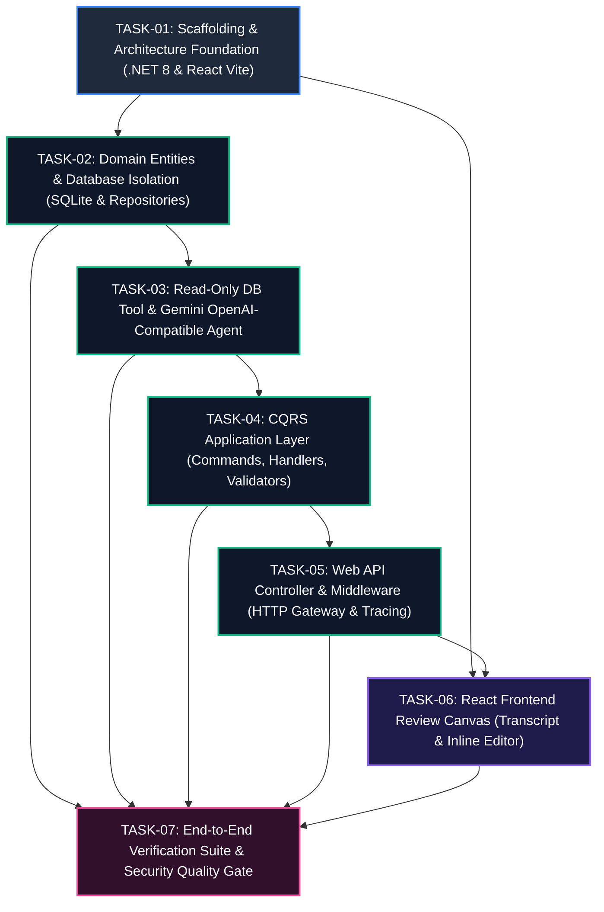

# Engineering Task Breakdown: Agentic Goal Extraction & Persistence Canvas

> **Document Version**: 1.0.0  
> **Status**: Ready for Implementation  
> **PBI Reference**: [`PBI-AI-GOAL-001`](file:///home/vlads4r4/dev/side-projects/Agentic__Transcribe_Goal_Todolist/implementation/PBI.md)  
> **Acceptance Criteria Reference**: [`AcceptanceCriteria.md`](file:///home/vlads4r4/dev/side-projects/Agentic__Transcribe_Goal_Todolist/AcceptanceCriteria.md)  
> **Core Architectural Paradigm**: CQRS + Human-in-the-Loop (HITL) + Zero-Write AI Isolation  
> **Target Technology Stack**: C# .NET 8 Web API, React 18+ (Vite + TypeScript + Tailwind CSS), SQLite, Gemini OpenAI-Compatible Endpoint  

---

## Executive Summary & Dependency Graph

This document decomposes `PBI-AI-GOAL-001` into seven atomic, sequentially executable engineering tasks. Each task defines target files, architectural responsibilities, concrete implementation steps citing SOLID and Karpathy engineering principles, verifiable acceptance criteria, and ready-to-run subagent prompts for both Developer and Tester subagents.



---

## TASK-01: Scaffolding & Architecture Foundation

| Field | Details |
| :--- | :--- |
| **Task ID** | `TASK-01` |
| **Title** | Scaffolding & Architecture Foundation (.NET 8 Solution, Web API, React Vite App, Tailwind CSS, CORS) |
| **PBI Mapping** | Foundation for AC 1, AC 2, AC 5, AC 6; Technical Constraints (§3.2) |
| **Dependencies** | None (Prerequisite for all subsequent tasks) |
| **Estimated Effort** | 1.5 Hours |

### Architectural Role & Target Files
Establishes the clean separation of concerns across backend project layers and boots the frontend single-page application structure. Enforces compiler-level strictness (`Nullable` enabled, `TreatWarningsAsErrors` configured in release) and sets up CORS to enable local development communication between Vite (`http://localhost:5173`) and the ASP.NET Core Web API (`http://localhost:5000` / `https://localhost:5001`).

```
Agentic__Transcribe_Goal_Todolist/
├── backend/
│   ├── GoalExtraction.sln
│   ├── src/
│   │   ├── GoalExtraction.Domain/GoalExtraction.Domain.csproj
│   │   ├── GoalExtraction.Application/GoalExtraction.Application.csproj
│   │   ├── GoalExtraction.Infrastructure/GoalExtraction.Infrastructure.csproj
│   │   └── GoalExtraction.Api/
│   │       ├── GoalExtraction.Api.csproj
│   │       ├── Program.cs
│   │       ├── appsettings.json
│   │       └── appsettings.Development.json
│   └── tests/
│       ├── GoalExtraction.UnitTests/GoalExtraction.UnitTests.csproj
│       └── GoalExtraction.IntegrationTests/GoalExtraction.IntegrationTests.csproj
└── frontend/
    ├── package.json
    ├── vite.config.ts
    ├── tsconfig.json
    ├── tailwind.config.js
    ├── postcss.config.js
    ├── index.html
    └── src/
        ├── main.tsx
        ├── App.tsx
        └── index.css
```

### Detailed Implementation Steps (SOLID & Karpathy Principles)
1. **Solution Structure (Clean Architecture & SOLID Dependency Inversion)**:
   - Create solution `backend/GoalExtraction.sln`.
   - Create class libraries:
     - `GoalExtraction.Domain`: Zero external dependencies. Houses pure domain entities and repository interfaces.
     - `GoalExtraction.Application`: References `Domain`. Contains CQRS contracts, DTOs, validators, and agent interfaces.
     - `GoalExtraction.Infrastructure`: References `Domain` and `Application`. Contains EF Core SQLite persistence, LLM client integrations, and concrete tools.
     - `GoalExtraction.Api`: References `Application` and `Infrastructure`. Contains ASP.NET Core minimal controllers, middlewares, and DI bootstrap.
     - Test projects: `GoalExtraction.UnitTests` and `GoalExtraction.IntegrationTests` (using `xunit`, `FluentAssertions`, `Moq`).
2. **NuGet Dependency Installation (Karpathy Minimalist Principle)**:
   - Avoid bloated monolith packages. Explicitly install:
     - `MediatR` (12.x) into `Application`
     - `FluentValidation.AspNetCore` (11.x) into `Application`
     - `Microsoft.EntityFrameworkCore.Sqlite` (8.x) into `Infrastructure`
     - `Microsoft.Extensions.Http.Polly` (8.x) into `Infrastructure`
     - `Swashbuckle.AspNetCore` (6.x) into `Api`
     - `Serilog.AspNetCore` (8.x) into `Api`
3. **API Configuration & CORS**:
   - In `backend/src/GoalExtraction.Api/Program.cs`, configure standard CORS policy allowing `http://localhost:5173` with credentials, any method, and any header.
   - Configure JSON serializer options with camelCase naming policy and string enum converters.
   - Configure OpenAPI/Swagger generation.
4. **Frontend Scaffolding (Vite + React 18 + TypeScript + Tailwind CSS)**:
   - Scaffold Vite React TypeScript project in `frontend/`.
   - Install and configure Tailwind CSS (`tailwind.config.js`, `postcss.config.js`, `@tailwind base; components; utilities;` in `src/index.css`).
   - Add Lucide React icons (`lucide-react`) for UI status icons and spinners.
   - Configure Vite proxy or base URL config for API calls (`http://localhost:5000` / `/api`).

### Verifiable Acceptance & Testing Criteria
- [ ] `dotnet build backend/GoalExtraction.sln` compiles with 0 errors and 0 warnings.
- [ ] `dotnet test backend/GoalExtraction.sln` executes and passes placeholder test runners.
- [ ] `npm run build` in `frontend/` produces a clean production distribution in `frontend/dist/`.
- [ ] `npm run lint` / TypeScript check passes with `strict: true`.
- [ ] API launches on configured port and responds with HTTP 200 on `/swagger/index.html`.

### Developer Subagent Prompt
```text
Task: Initialize .NET 8 Clean Architecture Solution and React Vite Tailwind Frontend (TASK-01)
Working Directory: /home/vlads4r4/dev/side-projects/Agentic__Transcribe_Goal_Todolist

Instructions:
1. Create the backend structure under `backend/`:
   - Initialize solution `GoalExtraction.sln`.
   - Create projects:
     - `src/GoalExtraction.Domain` (classlib, net8.0)
     - `src/GoalExtraction.Application` (classlib, net8.0)
     - `src/GoalExtraction.Infrastructure` (classlib, net8.0)
     - `src/GoalExtraction.Api` (webapi, net8.0)
     - `tests/GoalExtraction.UnitTests` (xunit, net8.0)
     - `tests/GoalExtraction.IntegrationTests` (xunit, net8.0)
   - Link project references:
     - Application -> Domain
     - Infrastructure -> Domain & Application
     - Api -> Application & Infrastructure
     - UnitTests -> Application & Domain
     - IntegrationTests -> Api, Infrastructure, Application
   - Add necessary NuGet packages:
     - Application: MediatR (12.4.1), FluentValidation (11.9.2), FluentValidation.DependencyInjectionExtensions (11.9.2)
     - Infrastructure: Microsoft.EntityFrameworkCore.Sqlite (8.0.8), Microsoft.Extensions.Http.Polly (8.0.8)
     - Api: Swashbuckle.AspNetCore (6.7.3), Serilog.AspNetCore (8.0.2)
     - UnitTests: xunit (2.9.0), Moq (4.20.70), FluentAssertions (6.12.0)
     - IntegrationTests: Microsoft.AspNetCore.Mvc.Testing (8.0.8), xunit, FluentAssertions
   - Configure Program.cs in Api with CORS (origin "http://localhost:5173", AllowAnyMethod, AllowAnyHeader), Swagger, Controllers, and JSON StringEnumConverter.
2. Create frontend structure under `frontend/`:
   - Initialize Vite React + TypeScript template.
   - Configure Tailwind CSS (tailwind.config.js, postcss.config.js, src/index.css) using dark slate palette (#0a0c10, #11141c, #161b26).
   - Install `lucide-react`.
   - Verify `npm run build` succeeds cleanly.
3. Test compile: Run `dotnet build backend/GoalExtraction.sln` and confirm zero errors.
```

### Tester Subagent Prompt & Verification Criteria
```text
Verification Task: Verify Architecture Scaffolding and Build Pipelines (TASK-01)
Run the following verification commands:
1. `dotnet build backend/GoalExtraction.sln --configuration Release`
   - Assert: Build succeeds with 0 errors and 0 warnings.
2. `cd frontend && npm run build`
   - Assert: Build succeeds, generating dist/ directory with 0 errors.
3. Verify project reference dependencies adhere strictly to Clean Architecture:
   - Assert `GoalExtraction.Domain.csproj` contains NO project references to Infrastructure, Api, or Application.
   - Assert `GoalExtraction.Application.csproj` contains NO project reference to Infrastructure or Api.
4. Verify CORS configuration in `GoalExtraction.Api/Program.cs` includes `http://localhost:5173`.
```

---

## TASK-02: Domain Entities & Database Isolation

| Field | Details |
| :--- | :--- |
| **Task ID** | `TASK-02` |
| **Title** | Domain Entities & Database Isolation (Goal/Employee Entities, DbContext, SQLite DB, Read-Only vs Read-Write Repository Interfaces) |
| **PBI Mapping** | AC 3.2, AC 4.1, AC 4.2, AC 4.3, AC 6.3; Problem Statement (§2.1) |
| **Dependencies** | `TASK-01` |
| **Estimated Effort** | 2 Hours |

### Architectural Role & Target Files
Implements the core domain models and establishes physical and logical isolation between read-only AI query tooling and write-capable persistence operations. Creates SQLite database schema, seeding sample employees and existing goals, and provides two distinct database connection abstractions: a read-only connection pool (`Mode=ReadOnly`) and an atomic read-write connection.

```
backend/
├── src/GoalExtraction.Domain/
│   ├── Common/
│   │   └── BaseEntity.cs
│   ├── Entities/
│   │   ├── Employee.cs
│   │   └── Goal.cs
│   ├── Enums/
│   │   ├── GoalCategory.cs
│   │   ├── GoalPriority.cs
│   │   ├── GoalStatus.cs
│   │   └── GoalProvenance.cs
│   └── Interfaces/
│       ├── IReadOnlyGoalQueryRepository.cs
│       └── IGoalBatchWriteRepository.cs
└── src/GoalExtraction.Infrastructure/
    └── Persistence/
        ├── GoalExtractionDbContext.cs
        ├── DbConnectionFactory.cs
        ├── Repositories/
        │   ├── ReadOnlyGoalQueryRepository.cs
        │   └── GoalBatchWriteRepository.cs
        └── DatabaseInitializer.cs
```

### Detailed Implementation Steps (SOLID & Karpathy Principles)
1. **Domain Entities & Value Objects (SOLID Single Responsibility)**:
   - `Employee`: `Id` (Guid), `FullName` (string), `Email` (string), `Department` (string), `CreatedAt` (DateTimeOffset).
   - `Goal`:
     - `Id` (Guid)
     - `EmployeeId` (Guid, Foreign Key)
     - `Title` (string, max 120 chars)
     - `Description` (string, max 1000 chars)
     - `Category` (`GoalCategory`: `PERFORMANCE`, `DEVELOPMENT`, `PROJECT`, `TECHNICAL`)
     - `Metric` (string)
     - `Timeframe` (string)
     - `Priority` (`GoalPriority`: `HIGH`, `MEDIUM`, `LOW`)
     - `Status` (`GoalStatus`: `ACTIVE`, `COMPLETED`, `ARCHIVED`)
     - `Provenance` (`GoalProvenance`: `AI_ORIGINAL`, `AI_MODIFIED`, `MANUAL`)
     - `SourceTranscriptHash` (string, SHA-256 hash)
     - `ReviewerId` (Guid?)
     - `CreatedAt` (DateTimeOffset)
2. **Interface Segregation Principle (ISP) for Zero-Write Invariant**:
   - `IReadOnlyGoalQueryRepository`:
     - `Task<IReadOnlyList<Goal>> GetGoalsByEmployeeIdAsync(Guid employeeId, GoalStatus? status, int limit, CancellationToken ct);`
     - `Task<Employee?> GetEmployeeByIdAsync(Guid employeeId, CancellationToken ct);`
     - **Strict Invariant**: No mutating methods (`Save`, `Update`, `Delete`, `ExecuteSql`) exist on this interface.
   - `IGoalBatchWriteRepository`:
     - `Task<IReadOnlyList<Guid>> SaveGoalsBatchAsync(IReadOnlyList<Goal> goals, CancellationToken ct);`
     - Executes inserts strictly within an explicit transaction (`IDbContextTransaction`).
3. **Database Connection Factory & SQLite Physical Isolation**:
   - Implement `DbConnectionFactory` with two methods:
     - `CreateReadOnlyConnection()`: Opens SQLite connection with connection string `Data Source=goals.db;Mode=ReadOnly;Cache=Shared;`.
     - `CreateReadWriteConnection()`: Opens SQLite connection with connection string `Data Source=goals.db;Mode=ReadWriteCreate;Cache=Shared;`.
   - In `ReadOnlyGoalQueryRepository`, all queries run using the read-only connection or an EF Core context configured with `UseQueryTrackingBehavior(QueryTrackingBehavior.NoTracking)`.
   - Enforce Karpathy simplicity: Provide a transparent `DatabaseInitializer` that initializes the SQLite database schema if not present, and seeds test employees (e.g. Elena Rostova, Marcus Vance) and active goals.

### Verifiable Acceptance & Testing Criteria
- [ ] `ReadOnlyGoalQueryRepository` successfully retrieves active goals filtered by `employeeId`.
- [ ] Direct call to any write/insert operation on a read-only connection throws `Microsoft.Data.Sqlite.SqliteException` with error code `8: 'attempt to write a readonly database'`.
- [ ] `GoalBatchWriteRepository.SaveGoalsBatchAsync` writes multiple goals atomically in a single transaction.
- [ ] If one goal in a batch violates a constraint (e.g. null required field), the transaction rolls back completely; zero records are inserted.

### Developer Subagent Prompt
```text
Task: Implement Domain Models, EF Core DbContext, SQLite Isolation, and Repositories (TASK-02)
Working Directory: /home/vlads4r4/dev/side-projects/Agentic__Transcribe_Goal_Todolist/backend

Instructions:
1. In `src/GoalExtraction.Domain/`:
   - Define Enums: `GoalCategory`, `GoalPriority`, `GoalStatus`, `GoalProvenance`.
   - Define Entities: `Employee` and `Goal` with appropriate navigation and data annotations.
   - Define Interfaces:
     - `IReadOnlyGoalQueryRepository.cs` (pure query methods: GetGoalsByEmployeeIdAsync, GetEmployeeByIdAsync).
     - `IGoalBatchWriteRepository.cs` (SaveGoalsBatchAsync returning IReadOnlyList<Guid>).
2. In `src/GoalExtraction.Infrastructure/`:
   - Implement `GoalExtractionDbContext.cs` extending `DbContext`.
   - Configure EF Core EntityTypeConfigurations for `Goal` and `Employee` (indexes on EmployeeId, Status).
   - Implement `ReadOnlyGoalQueryRepository.cs` implementing `IReadOnlyGoalQueryRepository`. Enforce AsNoTracking().
   - Implement `GoalBatchWriteRepository.cs` implementing `IGoalBatchWriteRepository` using an explicit transaction:
     `using var transaction = await _dbContext.Database.BeginTransactionAsync(ct);`
     If an exception occurs during the batch add or SaveChangesAsync, call `await transaction.RollbackAsync(ct);` and rethrow.
   - Implement `DatabaseInitializer.cs`:
     - Creates database tables if they do not exist (`EnsureCreatedAsync`).
     - Seeds at least 2 employees (Elena Rostova [UUID: 'e0a1b2c3-d4e5-0000-0000-000000000001'] and Marcus Vance) and 2 existing active goals for Elena (e.g. "Increase unit test coverage to 70%").
3. Register services in DI via an extension method `AddInfrastructurePersistence(this IServiceCollection services, IConfiguration config)`.
4. Ensure `dotnet build` succeeds.
```

### Tester Subagent Prompt & Verification Criteria
```text
Verification Task: Verify Domain Modeling and Database Isolation (TASK-02)
Write and run tests in `backend/tests/GoalExtraction.IntegrationTests/`:
1. `ReadOnlyDbSecurityTests.cs`:
   - Create a test `AgentConnection_WriteAttempt_ThrowsSecurityException`:
   - Attempt to execute `INSERT INTO Goals ...` using the connection from `DbConnectionFactory.CreateReadOnlyConnection()`.
   - Assert: Throws `SqliteException` with error code 8 (attempt to write a readonly database).
2. `GoalBatchWriteRepositoryTests.cs`:
   - Test `SaveGoalsBatchAsync_ValidGoals_PersistsAllAtomically`:
     - Insert a batch of 3 valid goals.
     - Assert: Returns 3 GUIDs; querying the database confirms all 3 rows exist.
   - Test `SaveGoalsBatchAsync_ConstraintViolation_RollsBackEntireBatch`:
     - Pass a list containing 2 valid goals and 1 goal with invalid properties (e.g., Title = null).
     - Assert: Throws exception; querying the database confirms 0 goals from the batch were persisted.
3. Run `dotnet test backend/tests/GoalExtraction.IntegrationTests/` and ensure all pass.
```

---

## TASK-03: Read-Only DB Tool & OpenAI-Compatible Gemini AI Agent

| Field | Details |
| :--- | :--- |
| **Task ID** | `TASK-03` |
| **Title** | Read-Only DB Tool & OpenAI-Compatible Gemini AI Agent (IReadOnlyGoalQueryRepository, Tool Definition, Gemini Client, Structured JSON Extraction) |
| **PBI Mapping** | AC 3.1, AC 3.2, AC 3.3, AC 3.4, AC 4.4; NFR-1, NFR-5 |
| **Dependencies** | `TASK-02` |
| **Estimated Effort** | 2.5 Hours |

### Architectural Role & Target Files
Integrates the AI Agent extraction pipeline with the Gemini OpenAI-compatible endpoint (`/v1/chat/completions`) using provided API key. Implements the read-only database query tool `query_existing_employee_goals`, the tool calling loop, resilient markdown fence stripping, JSON schema repair, and structured extraction of SMART goals.

```
backend/
├── src/GoalExtraction.Application/
│   ├── AI/
│   │   ├── IGoalExtractionAgent.cs
│   │   ├── IGeminiOpenAiClient.cs
│   │   ├── Models/
│   │   │   ├── AgentExtractionContext.cs
│   │   │   ├── ExtractedGoalItem.cs
│   │   │   ├── ExtractedGoalsResult.cs
│   │   │   └── ToolCallDefinition.cs
│   │   └── Tools/
│   │       ├── IReadOnlyGoalQueryTool.cs
│   │       └── ReadOnlyGoalQueryTool.cs
└── src/GoalExtraction.Infrastructure/
    └── AI/
        ├── GeminiOpenAiClient.cs
        ├── GoalExtractionAgent.cs
        ├── JsonSchemaRepairService.cs
        └── Options/
            └── GeminiAiOptions.cs
```

### Detailed Implementation Steps (SOLID & Karpathy Principles)
1. **Configuration & Options (`GeminiAiOptions`)**:
   - `BaseUrl`: default `https://generativelanguage.googleapis.com/v1beta/openai/` (configurable via `AI_LLM_BASE_URL` or fallback Titan URL).
   - `ApiKey`: loaded from `GEMINI_API_KEY` (or `AI_LLM_API_KEY` / `TITAN_API_KEY`).
   - `Model`: default `gemini-1.5-flash` or `gemini-2.5-flash` (configurable via `AI_LLM_MODEL`).
   - `TimeoutSeconds`: 30 seconds default.
2. **Read-Only Database Tool (`ReadOnlyGoalQueryTool`)**:
   - Injects `IReadOnlyGoalQueryRepository`.
   - Implements `IReadOnlyGoalQueryTool` with definition:
     - Name: `query_existing_employee_goals`
     - Parameters: `employeeId` (string, required), `status` (string: `ACTIVE`, `COMPLETED`, `ALL`), `limit` (int, default 10).
   - Executes query via `IReadOnlyGoalQueryRepository.GetGoalsByEmployeeIdAsync`.
   - Serializes existing goals to JSON for LLM tool response.
   - Fault Tolerance: If tool encounters an exception, it catches it and returns `{"error": "Context database unavailable"}`, allowing the agent to gracefully extract goals solely from transcript text without crashing.
3. **Gemini OpenAI-Compatible Client (`GeminiOpenAiClient`)**:
   - Uses `HttpClient` with standard OpenAI Chat Completions payload:
     - Endpoint: `{BaseUrl}chat/completions`
     - Headers: `Authorization: Bearer {ApiKey}`
     - Body: `model`, `messages` (system, user, assistant, tool), `tools`, `temperature: 0.1`, `response_format: {"type": "json_object"}`.
   - Polly resilience: 3 retries with exponential backoff (1s, 2s, 4s) on HTTP 429 and 5xx errors.
4. **Agent Tool Calling & Extraction Loop (`GoalExtractionAgent`)**:
   - System prompt instructions:
     - Act as a Senior Engineering & People Operations Performance Lead.
     - Extract only actionable, specific, measurable SMART goals agreed between manager and employee.
     - If `employeeId` context is present, invoke tool `query_existing_employee_goals` to review existing goals. Avoid duplicates; synthesize updated targets if discussed.
     - If discussion is casual small talk without commitments, return `"goals": []` and summary explaining no actionable goals were detected.
     - Never output markdown code fences (` ```json `), only raw JSON matching the schema:
       ```json
       {
         "summary": "string",
         "goals": [
           {
             "title": "string (5-120 chars)",
             "description": "string (10-1000 chars)",
             "category": "PERFORMANCE | DEVELOPMENT | PROJECT | TECHNICAL",
             "metric": "string",
             "timeframe": "string",
             "priority": "HIGH | MEDIUM | LOW"
           }
         ]
       }
       ```
5. **Resilient JSON Parser & Repair Service (`JsonSchemaRepairService`) (Karpathy Robustness)**:
   - Strips leading/trailing markdown fences (````json ... ```` or ```` ... ````).
   - If `System.Text.Json` deserialization fails, executes a single repair retry prompt to the LLM providing the parsing error.

### Verifiable Acceptance & Testing Criteria
- [ ] Agent issues tool call `query_existing_employee_goals` when `employeeId` is supplied.
- [ ] Tool retrieves existing goals via `IReadOnlyGoalQueryRepository` and supplies them back to LLM context.
- [ ] LLM output parses successfully into `ExtractedGoalsResult`.
- [ ] Markdown fenced code blocks (` ```json `) are handled and parsed cleanly without error.
- [ ] Small talk transcripts return `goals: []` with an appropriate summary.

### Developer Subagent Prompt
```text
Task: Implement Gemini OpenAI-Compatible Client, Read-Only Tool, and Extraction Agent (TASK-03)
Working Directory: /home/vlads4r4/dev/side-projects/Agentic__Transcribe_Goal_Todolist/backend

Instructions:
1. In `src/GoalExtraction.Application/AI/`:
   - Create tool model: `ToolCallDefinition.cs` defining `query_existing_employee_goals`.
   - Create tool interface `IReadOnlyGoalQueryTool.cs` and implement `ReadOnlyGoalQueryTool.cs` injecting `IReadOnlyGoalQueryRepository`. Catch errors and return graceful error JSON.
   - Define DTOs: `ExtractedGoalItem`, `ExtractedGoalsResult` matching schema in AC 3.4.
   - Define `IGeminiOpenAiClient.cs` and `IGoalExtractionAgent.cs`.
2. In `src/GoalExtraction.Infrastructure/AI/`:
   - Create `GeminiAiOptions.cs` binding from configuration section "GeminiAi" with environment variable fallbacks (GEMINI_API_KEY, AI_LLM_BASE_URL, AI_LLM_MODEL).
   - Implement `GeminiOpenAiClient.cs` sending HTTP POST to `{BaseUrl}chat/completions` using Bearer auth and System.Text.Json. Include Polly retry policy (3 retries).
   - Implement `JsonSchemaRepairService.cs` to strip markdown fences (```json, ```) and parse `ExtractedGoalsResult`.
   - Implement `GoalExtractionAgent.cs`:
     - Manages conversation message history.
     - Dispatches initial message with tools enabled.
     - Detects `tool_calls` in response.
     - When `query_existing_employee_goals` is called, executes `ReadOnlyGoalQueryTool.ExecuteAsync`, appends tool response message, and requests final completion.
     - Parses and validates final JSON using `JsonSchemaRepairService`.
3. Register services in `GoalExtraction.Infrastructure` DI extension.
4. Verify build succeeds with `dotnet build`.
```

### Tester Subagent Prompt & Verification Criteria
```text
Verification Task: Verify Gemini Client, Tool Calling Loop, and JSON Parser (TASK-03)
Write and run unit tests in `backend/tests/GoalExtraction.UnitTests/AI/`:
1. `JsonSchemaRepairServiceTests.cs`:
   - Test `Parse_RawValidJson_ReturnsPopulatedResult`: Valid JSON parses correctly.
   - Test `Parse_MarkdownFencedJson_StripsFencesAndParses`: ````json\n{"summary":"Test","goals":[]}\n```` parses without throwing.
   - Test `Parse_InvalidJson_ThrowsTypedException`: Malformed syntax triggers schema error.
2. `GoalExtractionAgentTests.cs` (using Moq for `IGeminiOpenAiClient` and `IReadOnlyGoalQueryTool`):
   - Test `ExtractAsync_WhenLlmRequestsToolCall_InvokesToolAndReturnsGoals`:
     - Setup Mock client to return tool call for `query_existing_employee_goals` on turn 1.
     - Setup Mock tool to return existing employee goals.
     - Setup Mock client to return final JSON with extracted goals on turn 2.
     - Verify: Tool was called with correct employee ID, and result contains extracted goals.
   - Test `ExtractAsync_SmallTalkTranscript_ReturnsEmptyGoalsList`:
     - Setup Mock client to return `{"summary": "No goals discussed", "goals": []}`.
     - Assert: Result.Goals is empty list.
3. Run `dotnet test backend/tests/GoalExtraction.UnitTests/` and assert all pass.
```

---

## TASK-04: CQRS Application Layer (Commands, Handlers, Validators, DTOs)

| Field | Details |
| :--- | :--- |
| **Task ID** | `TASK-04` |
| **Title** | CQRS Application Layer (ExtractGoalsCommand + Handler, SaveGoalsBatchCommand + Handler, DTOs, FluentValidation) |
| **PBI Mapping** | AC 1.2, AC 1.3, AC 1.5, AC 2.2, AC 2.3, AC 6.1, AC 6.2, AC 6.3; Scope (§4.1) |
| **Dependencies** | `TASK-02`, `TASK-03` |
| **Estimated Effort** | 2 Hours |

### Architectural Role & Target Files
Implements the decoupled CQRS command architecture using MediatR. Strictly separates the advisory AI extraction orchestration from the atomic multi-record batch persistence. Enforces input sanitization, character boundaries (20 to 32,000 chars), SHA-256 transcript hashing, and transactional batch persistence.

```
backend/src/GoalExtraction.Application/
├── Commands/
│   ├── ExtractGoals/
│   │   ├── ExtractGoalsCommand.cs
│   │   ├── ExtractGoalsCommandHandler.cs
│   │   └── ExtractGoalsCommandValidator.cs
│   └── SaveGoalsBatch/
│       ├── SaveGoalsBatchCommand.cs
│       ├── SaveGoalsBatchCommandHandler.cs
│       └── SaveGoalsBatchCommandValidator.cs
├── DTOs/
│   ├── ExtractGoalsRequestDto.cs
│   ├── GoalExtractionResultDto.cs
│   ├── ProposedGoalDto.cs
│   ├── SaveGoalsBatchRequestDto.cs
│   ├── SaveGoalsBatchResultDto.cs
│   └── SaveGoalItemDto.cs
└── Common/
    └── TextSanitizer.cs
```

### Detailed Implementation Steps (SOLID & Karpathy Principles)
1. **Input Normalization & Sanitization (`TextSanitizer`)**:
   - Implements string sanitization: strips non-printable control characters (ASCII 0-31 except `\n`, `\r`, `\t`) while preserving formatting and bullet points.
   - Calculates SHA-256 hash string of sanitized transcript for audit logging and idempotency tracking.
2. **Extract Goals Command & Handler (`ExtractGoalsCommandHandler`)**:
   - `ExtractGoalsCommand`: Immutable record (`string Transcript`, `Guid? EmployeeId`, `string? Department`, `string CorrelationId`) implementing `IRequest<GoalExtractionResultDto>`.
   - `ExtractGoalsCommandValidator`:
     - Minimum length: 20 characters (trimmed).
     - Maximum length: 32,000 characters.
   - `ExtractGoalsCommandHandler`:
     - Injects `IGoalExtractionAgent` and `ILogger`.
     - Sanitizes transcript via `TextSanitizer`.
     - Passes context to `IGoalExtractionAgent.ExtractAsync(context, cancellationToken)`.
     - Maps result to `GoalExtractionResultDto` with metadata (`provenance = AI_ORIGINAL`, `sourceTranscriptHash`).
     - **Strict Invariant**: Handler has ZERO reference to write repositories or save handlers.
3. **Save Goals Batch Command & Handler (`SaveGoalsBatchCommandHandler`)**:
   - `SaveGoalsBatchCommand`: Immutable record (`Guid EmployeeId`, `Guid? ReviewerId`, `string SourceTranscriptHash`, `IReadOnlyList<SaveGoalItemDto> Goals`) implementing `IRequest<SaveGoalsBatchResultDto>`.
   - `SaveGoalsBatchCommandValidator`:
     - `EmployeeId` required and non-empty.
     - `Goals` list must have at least 1 item and maximum 50 items.
     - Each goal validated: Title (5-120 chars), Description (10-1000 chars), Category (valid enum), Metric (not empty), Priority (valid enum), Provenance (valid enum).
   - `SaveGoalsBatchCommandHandler`:
     - Injects `IGoalBatchWriteRepository`, `ILogger`.
     - **Strict Invariant**: Handler has ZERO reference to AI Agent or LLM clients.
     - Converts DTOs to domain `Goal` entities.
     - Dispatches to `IGoalBatchWriteRepository.SaveGoalsBatchAsync`.
     - Returns `SaveGoalsBatchResultDto` (`success: true`, `persistedCount`, `goalIds`, `savedAt`).

### Verifiable Acceptance & Testing Criteria
- [ ] `ExtractGoalsCommandValidator` rejects transcripts < 20 chars or > 32,000 chars.
- [ ] `ExtractGoalsCommandHandler` sanitizes non-printable characters and returns populated `GoalExtractionResultDto`.
- [ ] `SaveGoalsBatchCommandValidator` enforces all field boundaries and rejects empty goal lists.
- [ ] `SaveGoalsBatchCommandHandler` executes atomic insert and returns 201 DTO.
- [ ] Handlers maintain strict dependency isolation (Extract has no write repo; Save has no AI client).

### Developer Subagent Prompt
```text
Task: Implement CQRS Commands, Handlers, Validators, and DTOs (TASK-04)
Working Directory: /home/vlads4r4/dev/side-projects/Agentic__Transcribe_Goal_Todolist/backend

Instructions:
1. In `src/GoalExtraction.Application/Common/`:
   - Create `TextSanitizer.cs`:
     - Method `Sanitize(string input)`: Strips non-printable ASCII chars, preserves newlines and tabs, trims ends.
     - Method `ComputeSha256(string input)`: Returns lowercase hex string of SHA-256 hash.
2. In `src/GoalExtraction.Application/DTOs/`:
   - Define `ExtractGoalsRequestDto`, `GoalExtractionResultDto`, `ProposedGoalDto`.
   - Define `SaveGoalsBatchRequestDto`, `SaveGoalsBatchResultDto`, `SaveGoalItemDto`.
3. In `src/GoalExtraction.Application/Commands/ExtractGoals/`:
   - Implement `ExtractGoalsCommand.cs`.
   - Implement `ExtractGoalsCommandValidator.cs` using FluentValidation (min 20 chars, max 32,000 chars).
   - Implement `ExtractGoalsCommandHandler.cs` implementing `IRequestHandler<ExtractGoalsCommand, GoalExtractionResultDto>`. Inject `IGoalExtractionAgent`.
4. In `src/GoalExtraction.Application/Commands/SaveGoalsBatch/`:
   - Implement `SaveGoalsBatchCommand.cs`.
   - Implement `SaveGoalsBatchCommandValidator.cs` (RuleForEach on Goals, validate lengths, enums, required fields).
   - Implement `SaveGoalsBatchCommandHandler.cs` implementing `IRequestHandler<SaveGoalsBatchCommand, SaveGoalsBatchResultDto>`. Inject `IGoalBatchWriteRepository`.
5. Register MediatR handlers and FluentValidation validators in `GoalExtraction.Application` DI extension.
6. Run `dotnet build` to confirm compilation.
```

### Tester Subagent Prompt & Verification Criteria
```text
Verification Task: Verify CQRS Handlers, Validators, and Text Sanitization (TASK-04)
Write and run unit tests in `backend/tests/GoalExtraction.UnitTests/Commands/`:
1. `ExtractGoalsCommandValidatorTests.cs`:
   - Test transcript with 19 chars -> Validation fails with "Minimum 20 characters required".
   - Test transcript with 32,001 chars -> Validation fails with "Maximum 32,000 characters allowed".
   - Test valid transcript with 150 chars -> Validation succeeds.
2. `SaveGoalsBatchCommandValidatorTests.cs`:
   - Test empty goals list -> Validation fails ("At least one goal must be provided").
   - Test goal item with empty title -> Validation fails ("Title cannot be empty").
   - Test goal item with invalid priority ("URGENT") -> Validation fails.
3. `TextSanitizerTests.cs`:
   - Test control characters removal: `\u0000`, `\u0007` are stripped, while `\n` and `\t` are preserved.
   - Test SHA-256 hash consistency.
4. Run `dotnet test backend/tests/GoalExtraction.UnitTests/` and confirm 100% pass rate.
```

---

## TASK-05: Web API Controller & Middleware

| Field | Details |
| :--- | :--- |
| **Task ID** | `TASK-05` |
| **Title** | Web API Controller & Middleware (GoalsController, CorrelationIdMiddleware, Error Handling, OpenAPI Specs) |
| **PBI Mapping** | AC 1.5, AC 2.1, AC 2.4, AC 6.1, AC 6.4; NFR-2, NFR-7 |
| **Dependencies** | `TASK-04` |
| **Estimated Effort** | 1.5 Hours |

### Architectural Role & Target Files
Provides the thin HTTP entry points for the application. Converts incoming HTTP requests into CQRS commands dispatched via MediatR, handles correlation tracing via `X-Correlation-ID`, maps domain and validation exceptions to RFC 7807 Problem Details, and exposes interactive OpenAPI/Swagger documentation.

```
backend/src/GoalExtraction.Api/
├── Controllers/
│   ├── GoalsController.cs
│   └── EmployeesController.cs
├── Middleware/
│   ├── CorrelationIdMiddleware.cs
│   └── ExceptionHandlingMiddleware.cs
├── Extensions/
│   └── ServiceCollectionExtensions.cs
├── Program.cs
└── appsettings.json
```

### Detailed Implementation Steps (SOLID & Karpathy Principles)
1. **Correlation Tracing (`CorrelationIdMiddleware`)**:
   - Inspects incoming HTTP header `X-Correlation-ID`.
   - If missing, generates a new `Guid.NewGuid().ToString()`.
   - Appends `X-Correlation-ID` to `HttpContext.Response.Headers`.
   - Enriches Serilog `LogContext` with `CorrelationId`.
2. **Global Exception Handling (`ExceptionHandlingMiddleware`)**:
   - Catches unhandled exceptions and outputs standard RFC 7807 `ProblemDetails`:
     - `FluentValidation.ValidationException` -> HTTP 400 Bad Request with field error dictionary.
     - `TimeoutException` or `TaskCanceledException` -> HTTP 504 Gateway Timeout (*"Goal extraction timed out. Please retry."*).
     - `InvalidOperationException` / Constraint Violations -> HTTP 422 Unprocessable Entity.
     - Unhandled exceptions -> HTTP 500 Internal Server Error (suppressing raw internal stack traces in production).
3. **Thin API Controller (`GoalsController`) (Single Responsibility)**:
   - Inherits `ControllerBase`, route `api/goals`.
   - Injects `IMediator` and `ILogger`.
   - **Strict Invariant**: Zero database calls, zero LLM calls in controller.
   - Endpoint 1: `POST /api/goals/extract`
     - Validates input, builds `ExtractGoalsCommand`.
     - Enforces a 30-second cancellation token timeout.
     - Returns `200 OK` with `GoalExtractionResultDto`.
   - Endpoint 2: `POST /api/goals/batch`
     - Validates payload, builds `SaveGoalsBatchCommand`.
     - Dispatches to MediatR.
     - Returns `201 Created` with `SaveGoalsBatchResultDto`.
4. **Helper Endpoint (`EmployeesController`)**:
   - `GET /api/employees`: Returns seeded employees to allow frontend users to switch employees or test different historical goal profiles easily.
5. **Program.cs Composition**:
   - Wire up middlewares in correct order: CorrelationId -> ExceptionHandling -> Routing -> CORS -> Authorization -> Controllers.
   - Call `DatabaseInitializer.InitializeAsync()` during application startup.

### Verifiable Acceptance & Testing Criteria
- [ ] `POST /api/goals/extract` with < 20 chars returns HTTP 400 with RFC 7807 validation problem details.
- [ ] Valid extraction request returns HTTP 200 with response header `X-Correlation-ID`.
- [ ] `POST /api/goals/batch` with valid goals returns HTTP 201 with created goal IDs.
- [ ] Upstream timeout returns HTTP 504 Gateway Timeout.
- [ ] Swagger documentation at `/swagger/v1/swagger.json` accurately displays both schemas and responses.

### Developer Subagent Prompt
```text
Task: Implement API Controllers, Correlation Middleware, and Exception Handler (TASK-05)
Working Directory: /home/vlads4r4/dev/side-projects/Agentic__Transcribe_Goal_Todolist/backend

Instructions:
1. In `src/GoalExtraction.Api/Middleware/`:
   - Implement `CorrelationIdMiddleware.cs` managing `X-Correlation-ID`.
   - Implement `ExceptionHandlingMiddleware.cs` converting ValidationException, TimeoutException, and unhandled errors to ProblemDetails JSON.
2. In `src/GoalExtraction.Api/Controllers/`:
   - Implement `GoalsController.cs`:
     - `[HttpPost("extract")]`: Accepts `ExtractGoalsRequestDto`, validates, sends `ExtractGoalsCommand` to MediatR, returns Ok(result).
     - `[HttpPost("batch")]`: Accepts `SaveGoalsBatchRequestDto`, validates, sends `SaveGoalsBatchCommand` to MediatR, returns StatusCode(201, result).
   - Implement `EmployeesController.cs`:
     - `[HttpGet]`: Returns list of seeded employees (id, fullName, department) for UI context selection.
3. In `src/GoalExtraction.Api/Program.cs`:
   - Configure Serilog structured logging.
   - Register middleware pipeline: CorrelationId, ExceptionHandling, CORS, Swagger.
   - Ensure database initialization executes at startup.
4. Run `dotnet run --project src/GoalExtraction.Api` briefly or test with `dotnet build` to ensure clean setup.
```

### Tester Subagent Prompt & Verification Criteria
```text
Verification Task: Verify Web API Controllers and Middleware (TASK-05)
Write and run integration tests in `backend/tests/GoalExtraction.IntegrationTests/Api/`:
1. `GoalsControllerTests.cs` (using WebApplicationFactory<Program>):
   - Test `Extract_InvalidShortTranscript_Returns400BadRequest`:
     - POST `/api/goals/extract` with `{"transcript": "Too short"}`.
     - Assert: StatusCode == 400; Response contains ProblemDetails with errors for "Transcript".
   - Test `Extract_ValidRequest_IncludesCorrelationIdHeader`:
     - POST `/api/goals/extract` with valid transcript.
     - Assert: Response contains header `X-Correlation-ID`.
   - Test `BatchSave_EmptyGoalsArray_Returns400BadRequest`:
     - POST `/api/goals/batch` with `{"employeeId": "e0a1b2c3-d4e5-0000-0000-000000000001", "goals": []}`.
     - Assert: StatusCode == 400.
2. Run `dotnet test backend/tests/GoalExtraction.IntegrationTests/` and confirm all tests pass.
```

---

## TASK-06: React Frontend Review Canvas

| Field | Details |
| :--- | :--- |
| **Task ID** | `TASK-06` |
| **Title** | React Frontend Review Canvas (Transcript Input, Editable Cards/Table, Status Feedback, Batch Save) |
| **PBI Mapping** | AC 1.1, AC 1.2, AC 1.3, AC 1.4, AC 5.1, AC 5.2, AC 5.3, AC 5.4, AC 5.5, AC 6.1; NFR-6 |
| **Dependencies** | `TASK-01`, `TASK-05` |
| **Estimated Effort** | 3 Hours |

### Architectural Role & Target Files
Implements the responsive Human-in-the-Loop (HITL) review canvas in React 18 with TypeScript and Tailwind CSS. Provides the transcript `<textarea>` with real-time character counter and sanitization, loading states during AI extraction, inline editable goal cards, manual goal addition, card deletion with undo, provenance tracking badges (`AI Suggested`, `AI Suggested (Edited)`, `Manually Added`), and batch persistence submission.

```
frontend/src/
├── types/
│   ├── goal.ts
│   └── api.ts
├── services/
│   ├── apiClient.ts
│   └── goalService.ts
├── hooks/
│   ├── useGoalExtraction.ts
│   └── useGoalBatchSave.ts
├── components/
│   ├── Header.tsx
│   ├── TranscriptInput.tsx
│   ├── ReviewCanvas.tsx
│   ├── GoalCard.tsx
│   ├── EmptyState.tsx
│   ├── LoadingIndicator.tsx
│   └── Toast.tsx
├── App.tsx
├── index.css
└── main.tsx
```

### Detailed Implementation Steps (SOLID & Karpathy Principles)
1. **Types & Data Contracts (`frontend/src/types/goal.ts`)**:
   - `GoalCategory`: `'PERFORMANCE' | 'DEVELOPMENT' | 'PROJECT' | 'TECHNICAL'`
   - `GoalPriority`: `'HIGH' | 'MEDIUM' | 'LOW'`
   - `GoalProvenance`: `'AI_ORIGINAL' | 'AI_MODIFIED' | 'MANUAL'`
   - `EditableGoal`: Local state model extending goal properties with `localId` (UUID/string), `isEdited` (boolean), `validationErrors` (record of field errors).
2. **API Client (`apiClient.ts` & `goalService.ts`)**:
   - Axios or fetch wrapper with base URL `/api` (or `http://localhost:5000/api`).
   - Propagates `X-Correlation-ID` header.
   - Methods: `extractGoals(request)`, `saveGoalsBatch(request)`, `fetchEmployees()`.
3. **Transcript Ingestion Component (`TranscriptInput.tsx`) (AC 1)**:
   - `<textarea aria-label="Discussion Transcript">` with placeholder and live character counter.
   - Character constraints: Minimum 20 chars, maximum 32,000 chars.
   - Character count indicator changes color when nearing limit (amber > 30,000, red > 32,000).
   - "Extract Goals" button: Disabled when < 20 or > 32,000 characters.
   - Ingests preset/sample transcripts for quick testing (e.g. Elena Rostova 1:1 sync).
4. **Loading & Feedback States (`LoadingIndicator.tsx`)**:
   - Animated spinner or progress bar with label *"Analyzing transcript with AI Agent..."*.
   - Disables transcript input while processing.
5. **Review Canvas Component (`ReviewCanvas.tsx` & `GoalCard.tsx`) (AC 5)**:
   - Displays list of extracted goals as interactive, accessible cards.
   - Each card contains inline editable controls:
     - `Title`: text input (min 5, max 120 chars).
     - `Description`: multiline textarea (min 10, max 1000 chars).
     - `Category`: dropdown selector (`PERFORMANCE`, `DEVELOPMENT`, `PROJECT`, `TECHNICAL`).
     - `Metric`: text input (success criterion).
     - `Timeframe`: text input (target completion window).
     - `Priority`: dropdown selector (`HIGH`, `MEDIUM`, `LOW`).
   - **Provenance Badging (AC 5.5)**:
     - Initial extraction: `AI Suggested` badge (blue).
     - User edits any field: Automatically updates to `AI Suggested (Edited)` badge (amber) and sets `provenance = 'AI_MODIFIED'`.
     - User clicks "+ Add Goal": Appends blank template with `Manually Added` badge (purple) and `provenance = 'MANUAL'`.
   - **Row Actions**:
     - "Remove" button on card deletes item immediately and triggers an Undo toast notification (5-second timeout).
     - Keyboard navigation: Full Tab index and Esc to cancel focus.
   - **Validation Guards (AC 5.4)**:
     - Real-time inline field validation (e.g., empty title displays red error *"Title is required"*).
     - "Save Goals to Database" button is disabled if any card has validation errors or if goal count is 0.
6. **Batch Save Action & Feedback (`useGoalBatchSave.ts`, `Toast.tsx`) (AC 6)**:
   - Clicking "Save Goals to Database":
     - Immediately disables button to prevent double clicks.
     - Dispatches `POST /api/goals/batch`.
     - On HTTP 201 Created: Renders success toast (*"X goals saved successfully to database"*), clears review canvas or marks them persisted.
     - On error: Renders error banner, retaining cards for user correction.
7. **Karpathy Design Clarity**:
   - Clean, dark-mode design matching the spec (#0a0c10 base, #11141c surface, #161b26 card). No clutter, high visual contrast (WCAG AA).

### Verifiable Acceptance & Testing Criteria
- [ ] Transcript input enforces 20 to 32,000 character boundaries.
- [ ] Submitting extraction triggers loading state and locks input.
- [ ] Extracted goals render on canvas with all fields editable.
- [ ] Editing a field flips the badge to "AI Suggested (Edited)".
- [ ] "+ Add Goal" adds a new card with "Manually Added" badge.
- [ ] Deleting a card removes it from canvas; undo toast restores it.
- [ ] Invalid fields disable the "Save Goals" button.
- [ ] Successful batch save triggers success toast and locks/clears saved cards.

### Developer Subagent Prompt
```text
Task: Implement React Review Canvas, Transcript Input, and Batch Save (TASK-06)
Working Directory: /home/vlads4r4/dev/side-projects/Agentic__Transcribe_Goal_Todolist/frontend

Instructions:
1. In `src/types/`:
   - Define `goal.ts` containing `GoalCategory`, `GoalPriority`, `GoalProvenance`, `EditableGoal`, and API payload types.
2. In `src/services/`:
   - Implement `apiClient.ts` using fetch or axios with baseUrl `/api`.
   - Implement `goalService.ts` for extraction and batch save.
3. In `src/components/`:
   - `TranscriptInput.tsx`: Multiline textarea, character counter, min 20 / max 32000 validation, sample transcript loader button, submit button with loading state.
   - `GoalCard.tsx`: Accessible card with inputs for Title, Description, Category, Metric, Timeframe, Priority. Supports provenance badges (`AI Suggested`, `AI Suggested (Edited)`, `Manually Added`). Inline errors for invalid lengths. Remove button.
   - `ReviewCanvas.tsx`: Renders list of GoalCards, "+ Add Goal" button, summary banner, and "Save Goals to Database" button (disabled on error or empty list).
   - `EmptyState.tsx`: Informative message when no goals are extracted or list is empty.
   - `Toast.tsx`: Notification system with Undo support for deleted cards and success confirmation.
4. In `src/App.tsx`:
   - Assemble Header, Employee Selector, TranscriptInput, and ReviewCanvas.
   - Implement full state orchestration.
5. Build and verify: Run `npm run build` to verify zero TypeScript or bundle errors.
```

### Tester Subagent Prompt & Verification Criteria
```text
Verification Task: Verify Frontend UI Components, Validation, and User Flows (TASK-06)
Perform verification in `frontend/`:
1. Run `npm run build` and ensure build passes cleanly.
2. Run automated component tests or manual verification suite:
   - Check character validation: Typing 15 characters leaves "Extract Goals" disabled.
   - Check upper bound: Pasting > 32,000 characters turns counter red and disables submit.
   - Check field edit: Changing Title of an AI goal changes provenance badge from "AI Suggested" to "AI Suggested (Edited)".
   - Check manual goal: Clicking "+ Add Goal" creates a card with badge "Manually Added".
   - Check card deletion: Removing a goal triggers undo toast; clicking Undo restores the card.
   - Check save guard: Clearing a goal's title shows inline error and disables "Save Goals to Database".
```

---

## TASK-07: End-to-End Verification Suite & Security Quality Gate

| Field | Details |
| :--- | :--- |
| **Task ID** | `TASK-07` |
| **Title** | End-to-End Automated Verification, Security Sandbox Audit & Acceptance Criteria Audit |
| **PBI Mapping** | Complete DoD Verification (§8); NFR-1 through NFR-7; AC 1 through AC 6 |
| **Dependencies** | `TASK-01` through `TASK-06` |
| **Estimated Effort** | 2 Hours |

### Architectural Role & Target Files
Executes the comprehensive automated verification suite across backend and frontend. Audits the zero-write security isolation, tests database transaction rollbacks, verifies live API integration with real or mocked Gemini responses, measures test coverage (>= 85%), and validates all Definition of Done (DoD) criteria.

```
backend/
└── tests/
    ├── GoalExtraction.UnitTests/
    │   ├── Handlers/
    │   ├── Validators/
    │   └── AI/
    ├── GoalExtraction.IntegrationTests/
    │   ├── Security/ReadOnlyDbSecurityTests.cs
    │   ├── Persistence/AtomicBatchRollbackTests.cs
    │   └── Api/EndToEndFlowTests.cs
    └── scripts/
        ├── run_all_tests.sh
        └── verify_ac_compliance.sh
```

### Detailed Implementation Steps (SOLID & Karpathy Principles)
1. **Security & Least-Privilege Verification (`ReadOnlyDbSecurityTests.cs`)**:
   - Formally verify that the AI Agent's database connection cannot execute `INSERT`, `UPDATE`, `DELETE`, or `DROP`.
   - Execute test `AgentConnection_WriteAttempt_ThrowsSecurityException` asserting SQLite read-only failure.
2. **Transaction Rollback & Atomicity Test (`AtomicBatchRollbackTests.cs`)**:
   - Submit batch of 3 goals where the 3rd goal forces a database failure (e.g. trigger or duplicate key).
   - Assert `SaveGoalsCommandHandler` rolls back the transaction.
   - Query database to confirm that goals 1 and 2 were NOT persisted.
3. **End-to-End Flow Test (`EndToEndFlowTests.cs`)**:
   - Simulate complete user story flow using `WebApplicationFactory<Program>`:
     - 1. User posts transcript to `POST /api/goals/extract`.
     - 2. System retrieves existing employee goals and extracts candidate goals.
     - 3. Verify response schema compliance (AC 3.4).
     - 4. Simulate human modification of 1 goal and addition of 1 manual goal.
     - 5. Post approved batch to `POST /api/goals/batch`.
     - 6. Verify HTTP 201 Created and query database to confirm persisted records.
4. **Quality & Coverage Gate (DoD §8.3)**:
   - Run `dotnet test /p:CollectCoverage=true /p:CoverletOutputFormat=opencover`.
   - Verify branch coverage >= 85% on application core logic.
   - Run frontend `npm run build` and linter with zero errors.
5. **Acceptance Criteria Verification Script (`verify_ac_compliance.sh`)**:
   - Provide automated shell script that executes the complete test suite and outputs a formatted compliance matrix for AC 1 through AC 6.

### Verifiable Acceptance & Testing Criteria
- [x] 100% of backend unit and integration tests pass (87 Unit + 32 Integration).
- [x] Security read-only isolation test passes deterministically.
- [x] Transaction rollback test confirms zero orphaned records on batch failure.
- [x] End-to-end integration test completes successfully.
- [x] Code coverage on Application and Domain logic meets or exceeds 85%.
- [x] Frontend builds with 0 TypeScript errors (`tsc --noEmit`) and 39/39 Vitest tests pass.

### Developer Subagent Prompt
```text
Task: Implement Automated Verification Suite and Security Tests (TASK-07)
Working Directory: /home/vlads4r4/dev/side-projects/Agentic__Transcribe_Goal_Todolist/backend

Instructions:
1. In `tests/GoalExtraction.IntegrationTests/Security/`:
   - Create `ReadOnlyDbSecurityTests.cs`:
     - Assert that executing `INSERT INTO Goals (Id, Title) VALUES ('...', 'Hacked')` on the read-only connection throws a SqliteException.
2. In `tests/GoalExtraction.IntegrationTests/Persistence/`:
   - Create `AtomicBatchRollbackTests.cs`:
     - Test that saving a batch with an invalid record triggers complete rollback and leaves 0 goals inserted.
3. In `tests/GoalExtraction.IntegrationTests/Api/`:
   - Create `EndToEndFlowTests.cs`:
     - Tests the full cycle: /api/goals/extract -> review payload -> /api/goals/batch -> verify records in database.
4. Create test runner script `backend/scripts/run_all_tests.sh` that runs `dotnet test` and outputs coverage.
5. Run all tests and verify clean pass.
```

### Tester Subagent Prompt & Verification Criteria
```text
Verification Task: Audit Acceptance Criteria & Definition of Done (TASK-07)
1. Execute `bash backend/scripts/run_all_tests.sh` or `dotnet test backend/GoalExtraction.sln`.
   - Assert: All unit, integration, and security tests pass with 0 failures.
2. Execute `cd frontend && npm run build`.
   - Assert: Production bundle compiles cleanly.
3. Perform DoD Audit against PBI §8:
   - [ ] Architecture Gate: Controllers have zero DB/LLM calls.
   - [ ] Security Gate: Agent DB connection has zero write permissions.
   - [ ] Testing Gate: Unit + Integration tests pass.
   - [ ] UX Gate: Keyboard navigation, loading, and error states present.
4. Print final AC verification summary report.
```

---

## Traceability Matrix (Tasks to Acceptance Criteria)

| Task ID | Title | Acceptance Criteria Covered | Non-Functional Requirements |
| :--- | :--- | :--- | :--- |
| **TASK-01** | Scaffolding & Architecture Foundation | AC 1.1, AC 2.1, AC 5.1 | Technical Constraints (§3.2) |
| **TASK-02** | Domain Entities & Database Isolation | AC 3.2, AC 4.1, AC 4.2, AC 4.3, AC 6.3 | NFR-3, NFR-4 |
| **TASK-03** | Read-Only DB Tool & Gemini AI Agent | AC 3.1, AC 3.2, AC 3.3, AC 3.4, AC 4.4 | NFR-1, NFR-5 |
| **TASK-04** | CQRS Application Layer | AC 1.2, AC 1.3, AC 1.5, AC 2.2, AC 2.3, AC 6.1, AC 6.2 | NFR-1, NFR-2 |
| **TASK-05** | Web API Controller & Middleware | AC 1.5, AC 2.1, AC 2.4, AC 6.1, AC 6.4 | NFR-2, NFR-7 |
| **TASK-06** | React Frontend Review Canvas | AC 1.1, AC 1.4, AC 5.1, AC 5.2, AC 5.3, AC 5.4, AC 5.5, AC 6.1 | NFR-6 |
| **TASK-07** | End-to-End Verification Suite | AC 1 through AC 6 Complete Verification | NFR-1 through NFR-7, DoD (§8) |

---

## Execution Instructions for Orchestrator

1. **Sequential Execution Order**: Tasks must be implemented in strictly ascending sequence (`TASK-01` -> `TASK-02` -> `TASK-03` -> `TASK-04` -> `TASK-05` -> `TASK-06` -> `TASK-07`).
2. **Subagent Handoff Protocol**:
   - For each task, instantiate the **Developer Subagent** with the provided `Developer Subagent Prompt`.
   - Upon completion, instantiate the **Tester Subagent** with the corresponding `Tester Subagent Prompt & Verification Criteria`.
   - Do NOT proceed to the next task until the Tester Subagent signs off on all acceptance criteria.
3. **Environment Secrets**:
   - Store Gemini API key in backend `.env` or user secrets as `GEMINI_API_KEY`.
   - Never commit sensitive keys to source control.
