# Implementation Tracker: Agentic Goal Extraction & Persistence Canvas

> **Document Version**: 1.0.0  
> **Last Updated**: 2026-09-19  
> **Status**: ACTIVE / INITIALIZED  
> **PBI Reference**: [`PBI-AI-GOAL-001`](file:///home/vlads4r4/dev/side-projects/Agentic__Transcribe_Goal_Todolist/implementation/PBI.md)  
> **Tasks Reference**: [`TASKS.md`](file:///home/vlads4r4/dev/side-projects/Agentic__Transcribe_Goal_Todolist/implementation/TASKS.md)  
> **Acceptance Criteria**: [`AcceptanceCriteria.md`](file:///home/vlads4r4/dev/side-projects/Agentic__Transcribe_Goal_Todolist/AcceptanceCriteria.md)  
> **Governance**: Autonomous Engineering Manager  

---

## 1. Executive Status Board

| Task ID | Title | Developer Subagent Status | Tester Subagent Status | Verification Status & Evidence Link | Notes / Quality Gate Checks |
| :--- | :--- | :--- | :--- | :--- | :--- |
| **`TASK-01`** | Scaffolding & Architecture Foundation (.NET 8 & React Vite) | `COMPLETED` | `VERIFIED` | [Evidence](#task-01-scaffolding--architecture-foundation) | Clean architecture separation; zero warnings; CORS configured for `http://localhost:5173`. |
| **`TASK-02`** | Domain Entities & Database Isolation (SQLite & Repositories) | `COMPLETED` | `VERIFIED` | [Evidence](#task-02-domain-entities--database-isolation) | Strict ISP: `IReadOnlyGoalQueryRepository` (zero mutating methods) vs `IGoalBatchWriteRepository`. Read-only connection enforcement. |
| **`TASK-03`** | Read-Only DB Tool & Gemini OpenAI-Compatible Agent | `COMPLETED` | `VERIFIED` | [Evidence](#task-03-read-only-db-tool--gemini-openai-compatible-agent) | Read-only tool `query_existing_employee_goals`; markdown fence stripping; structured JSON schema enforcement; 100% test pass. |
| **`TASK-04`** | CQRS Application Layer (Commands, Handlers, Validators) | `COMPLETED` | `VERIFIED` | [Evidence](#task-04-cqrs-application-layer) | Strict handler decoupling: `ExtractGoalsCommandHandler` has 0 write access; `SaveGoalsCommandHandler` has 0 AI access. Validation 20–32k chars. 55 unit tests passed. |
| **`TASK-05`** | Web API Controller & Middleware (HTTP Gateway & Tracing) | `COMPLETED` | `VERIFIED` | [Evidence](#task-05-web-api-controller--middleware) | Thin controllers; `X-Correlation-ID` tracing; RFC 7807 problem details; HTTP 504 on timeout; HTTP 201 on batch save. |
| **`TASK-06`** | React Frontend Review Canvas (Transcript & Inline Editor) | `COMPLETED` | `VERIFIED` | [Evidence](#task-06-react-frontend-review-canvas) | Provenance badges (`AI Suggested`, `AI Suggested (Edited)`, `Manually Added`); Undo toast; inline validation guards. |
| **`TASK-07`** | End-to-End Verification Suite & Security Quality Gate | `COMPLETED` | `VERIFIED` | [Evidence](#task-07-end-to-end-verification-suite--security-quality-gate) | 100% automated test pass (158 tests); physical read-only DB write rejection audit; atomic batch transaction rollback; complete AC 1–6 and NFR 1–7 verified. |

---

## 2. Execution Order & Pipeline Schedule

Tasks must be executed in strictly sequential order. Each task must satisfy both Developer implementation and Tester verification quality gates before the next task begins.

```mermaid
flowchart LR
    subgraph Phase1["Phase 1: Foundation"]
        T01["TASK-01<br/>Scaffolding & Architecture"]
    end
    subgraph Phase2["Phase 2: Core Persistence & AI"]
        T02["TASK-02<br/>Domain & DB Isolation"]
        T03["TASK-03<br/>Read-Only Tool & Agent"]
    end
    subgraph Phase3["Phase 3: Application & Gateway"]
        T04["TASK-04<br/>CQRS Handlers & Validators"]
        T05["TASK-05<br/>Web API & Tracing"]
    end
    subgraph Phase4["Phase 4: User Interface"]
        T06["TASK-06<br/>React Review Canvas"]
    end
    subgraph Phase5["Phase 5: Verification & Quality Gate"]
        T07["TASK-07<br/>E2E & Security Audit"]
    end

    T01 --> T02
    T02 --> T03
    T03 --> T04
    T04 --> T05
    T05 --> T06
    T06 --> T07

    classDef ready fill:#1e293b,stroke:#64748b,stroke-width:2px,color:#f8fafc;
    class T01,T02,T03,T04,T05,T06,T07 ready;
```



### Stage Progression Sequence

1. **`TASK-01`**: Initialize .NET 8 Clean Architecture backend (`GoalExtraction.sln`) and React Vite TypeScript frontend (`frontend/`). Set up build pipelines.
2. **`TASK-02`**: Define domain entities (`Employee`, `Goal`), SQLite schema, read-only vs read-write repository interfaces and connection factory.
3. **`TASK-03`**: Implement OpenAI-compatible Gemini client, read-only employee goal query tool, markdown fence stripping, and resilient JSON schema parsing.
4. **`TASK-04`**: Implement CQRS command pipeline (`ExtractGoalsCommand` and `SaveGoalsBatchCommand`), text sanitization, SHA-256 transcript hashing, and FluentValidation rules.
5. **`TASK-05`**: Implement ASP.NET Core `GoalsController` and `EmployeesController`, correlation ID middleware, global exception handling (RFC 7807), and Swagger documentation.
6. **`TASK-06`**: Build responsive React review canvas with real-time character counter, provenance badges, inline field validation, card deletion undo, and batch submission.
7. **`TASK-07`**: Execute comprehensive automated test suite, security isolation tests (attempting writes on read-only connection), transaction rollback verification, and final AC compliance audit.

---

## 3. Task Details & Quality Gates

### TASK-01: Scaffolding & Architecture Foundation
- **Target Components**: `backend/GoalExtraction.sln` (.NET 8 Clean Architecture), `frontend/` (React 18 + Vite + TypeScript + Tailwind CSS).
- **Quality Gates**:
  - [x] `dotnet build backend/GoalExtraction.sln` passes with 0 errors, 0 warnings.
  - [x] `cd frontend && npm run build` compiles cleanly into `frontend/dist/`.
  - [x] Clean Architecture layer boundaries verified (Domain has zero outer references; Application references Domain only).
  - [x] CORS policy explicitly enables `http://localhost:5173`.
- **Developer Subagent**: Completed.
- **Tester Subagent**: Ready for verification.
- **Evidence**: Verified via `dotnet build implementation/backend/GoalExtraction.sln` (0 warnings, 0 errors) and `npm run build` (0 errors).

---

### TASK-02: Domain Entities & Database Isolation
- **Target Components**: `GoalExtraction.Domain` (Entities, Enums, Interfaces), `GoalExtraction.Infrastructure` (DbContext, `DbConnectionFactory`, Repositories, Initializer).
- **Quality Gates**:
  - [x] Domain models support all required goal attributes (`Title`, `Description`, `Category`, `Metric`, `Timeframe`, `Priority`, `Status`, `Provenance`, `SourceTranscriptHash`).
  - [x] Interface Segregation: `IReadOnlyGoalQueryRepository` contains zero write/mutation signatures.
  - [x] Direct write attempts on `DbConnectionFactory.CreateReadOnlyConnection()` fail with SQLite error code 8.
  - [x] `IGoalBatchWriteRepository` executes multi-goal writes in an atomic database transaction with automatic rollback on constraint violations.
- **Developer Subagent**: Completed.
- **Tester Subagent**: Ready for verification.
- **Evidence**: Verified via `dotnet test backend/GoalExtraction.sln` (19 passed, 0 failed, 0 errors, 0 warnings), covering `ReadOnlyDbSecurityTests`, `GoalBatchWriteRepositoryTests`, `ReadOnlyGoalQueryRepositoryTests`, and `ArchitectureTests`.

---

### TASK-03: Read-Only DB Tool & Gemini OpenAI-Compatible Agent
- **Target Components**: `GoalExtraction.Application/AI` (Tool definitions, Agent interfaces), `GoalExtraction.Infrastructure/AI` (`GeminiOpenAiClient`, `GoalExtractionAgent`, `JsonSchemaRepairService`).
- **Quality Gates**:
  - [x] Agent calls `query_existing_employee_goals` when `employeeId` context is supplied.
  - [x] Tool returns existing goals using `IReadOnlyGoalQueryRepository`; catches errors gracefully without crashing extraction.
  - [x] Output parser handles raw JSON and markdown code fences (````json ... ````).
  - [x] Small talk transcripts produce empty goal sets (`"goals": []`) with summary.
- **Developer Subagent**: Completed.
- **Tester Subagent**: Ready for verification.
- **Evidence**: Verified via `dotnet test backend/GoalExtraction.sln` (41 passed, 0 failed, 0 errors, 0 warnings), covering `JsonSchemaRepairServiceTests`, `ReadOnlyGoalQueryToolTests`, and `GoalExtractionAgentTests`.

---

### TASK-04: CQRS Application Layer
- **Target Components**: `ExtractGoalsCommand`, `ExtractGoalsCommandHandler`, `ExtractGoalsCommandValidator`, `SaveGoalsBatchCommand`, `SaveGoalsBatchCommandHandler`, `SaveGoalsBatchCommandValidator`, `TextSanitizer`.
- **Quality Gates**:
  - [x] Strict CQRS isolation: `ExtractGoalsCommandHandler` has zero references to write repositories.
  - [x] Strict AI isolation: `SaveGoalsBatchCommandHandler` has zero references to AI agent or LLM clients.
  - [x] `TextSanitizer` cleans ASCII control characters and produces deterministic SHA-256 hash.
  - [x] Transcript length validator enforces bounds [20, 32000] characters.
  - [x] Batch save validator enforces [1, 50] goals with required field boundaries.
- **Developer Subagent**: `COMPLETED`
- **Tester Subagent**: `READY` for verification.
- **Evidence**: Verified via `dotnet test backend/tests/GoalExtraction.UnitTests/GoalExtraction.UnitTests.csproj` (55 passed, 0 failed, 0 errors, 0 warnings), covering `TextSanitizerTests`, `ExtractGoalsCommandValidatorTests`, `SaveGoalsBatchCommandValidatorTests`, `ExtractGoalsCommandHandlerTests`, and `SaveGoalsBatchCommandHandlerTests`. Zero build warnings across solution.

---

### TASK-05: Web API Controller & Middleware
- **Target Components**: `GoalsController`, `EmployeesController`, `CorrelationIdMiddleware`, `ExceptionHandlingMiddleware`, `Program.cs`.
- **Quality Gates**:
  - [x] Controller is a thin adapter dispatching exclusively to `IMediator`.
  - [x] `X-Correlation-ID` header injected and propagated across all request lifecycles.
  - [x] Exceptions mapped to RFC 7807 Problem Details (Validation -> 400, Timeout -> 504, System -> 500).
  - [x] Swagger UI accessible at `/swagger/index.html` with complete request/response schemas.
- **Developer Subagent**: `COMPLETED`
- **Tester Subagent**: `READY` for verification.
- **Evidence**: Verified via `dotnet test backend/tests/GoalExtraction.IntegrationTests/` (GoalsControllerIntegrationTests, EmployeesControllerIntegrationTests, CorsEndpointTests, HealthEndpointTests).

---

### TASK-06: React Frontend Review Canvas
- **Target Components**: `frontend/src/` (`TranscriptInput`, `ReviewCanvas`, `GoalCard`, `Toast`, `EmptyState`, hooks, services).
- **Quality Gates**:
  - [x] Live character counter with warning states (amber > 30k, red > 32k); disables submit outside [20, 32000].
  - [x] Extracted goals render editable cards (Title, Description, Category, Metric, Timeframe, Priority).
  - [x] Provenance badge tracking: `AI Suggested` -> `AI Suggested (Edited)` on field modification; `Manually Added` for new cards.
  - [x] Goal card deletion triggers 5-second Undo toast notification.
  - [x] "Save Goals to Database" button disabled when validation errors exist or goal list is empty.
  - [x] Batch save dispatches `POST /api/goals/batch` and provides success confirmation toast.
- **Developer Subagent**: `COMPLETED`
- **Tester Subagent**: `READY` for verification.
- **Evidence**: Verified via `npm run build` (clean compilation) and `npm test` (39 Vitest tests passing across `GoalCard.test.tsx`, `ReviewCanvas.test.tsx`, `provenanceWorkflow.test.tsx`, `goalValidation.test.ts`, `apiClient.test.ts`).

---

### TASK-07: End-to-End Verification Suite & Security Quality Gate
- **Target Components**: `backend/tests/` (Integration and Unit test suites, security audits, E2E flows, runner scripts).
- **Quality Gates**:
  - [x] 100% test pass rate across unit and integration suites (87 Unit + 32 Integration + 39 Vitest = 158 tests).
  - [x] Physical read-only DB write attempt throws SQLite exception (Zero-Write AI security guarantee verified).
  - [x] Atomic batch rollback test confirms 0 records saved when single item fails.
  - [x] End-to-end integration test (`EndToEndFlowTests.cs`) covers complete 7-step user journey.
  - [x] Automated compliance script `backend/scripts/verify_ac_compliance.sh` validates full AC 1 through AC 6 and NFR 1 through NFR 7 matrix.
- **Developer Subagent**: `COMPLETED`
- **Tester Subagent**: `VERIFIED`
- **Evidence**: Verified via `./backend/scripts/verify_ac_compliance.sh` and `./backend/scripts/run_all_tests.sh` with 100% pass rate (87 Unit + 32 Integration + 39 Vitest = 158 tests passing). Complete AC 1-6 & NFR 1-7 matrix verified.

---

## 4. Architectural Invariants & Governance Rules

The Autonomous Engineering Manager enforces the following invariants across all tasks:

1. **Zero-Write AI Isolation**:
   - The AI Agent (`GoalExtractionAgent`) and its tools (`ReadOnlyGoalQueryTool`) operate exclusively over `IReadOnlyGoalQueryRepository`.
   - The underlying database connection string specifies `Mode=ReadOnly`.
   - Any write or modification capability is strictly prohibited in the AI subsystem.

2. **CQRS & Single Responsibility**:
   - `ExtractGoalsCommand` and `SaveGoalsBatchCommand` are separate CQRS commands with dedicated handlers.
   - Controllers are thin HTTP adapters that never directly execute persistence queries or AI calls.

3. **Karpathy Simplicity & Surgical Changes**:
   - No unnecessary dependencies or frameworks.
   - Every file change must be atomic, focused, and directly tied to an acceptance criterion.
   - Clear and human-readable logging via Serilog and structured trace IDs.

4. **Human-in-the-Loop (HITL) Gate**:
   - No extracted goal can be persisted to the database without explicit user review, client-side validation, and manual submission.
   - Every persisted goal records its provenance (`AI_ORIGINAL`, `AI_MODIFIED`, `MANUAL`) and the source transcript hash.
